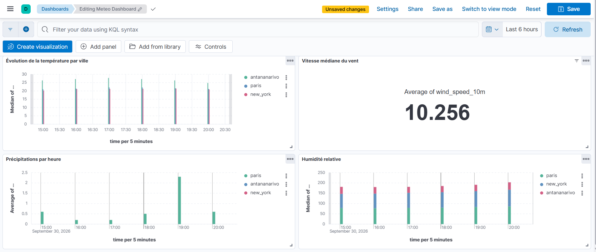

# Projet Final — Pipeline ETL avec Apache Airflow, Elasticsearch et Kibana

## Contexte et Objectif

Ce projet s'inscrit dans le cadre d'un cas pratique de Data Engineering visant à automatiser un pipeline ETL complet pour collecter, transformer, valider, stocker, analyser et visualiser des données météorologiques. L'orchestration est réalisée avec **Apache Airflow**, le stockage des données avec **Elasticsearch**, et la restitution sous forme de tableaux de bord interactifs avec **Kibana**.

## Architecture

```
Open-Meteo → Airflow (extract → transform → validate → load) → Elasticsearch → Kibana
```

Services Docker :

| Service           | Rôle                               | Port |
| ----------------- | ----------------------------------- | ---- |
| elasticsearch     | Stockage et indexation des données | 9200 |
| kibana            | Visualisation / dashboard           | 5601 |
| postgres          | Base de métadonnées Airflow       | -    |
| airflow-webserver | Interface web Airflow               | 8080 |
| airflow-scheduler | Orchestrateur des DAGs              | -    |

## Prérequis et Environnement

Le projet a été développé et testé sous **Windows** en utilisant **Docker Desktop** avec le backend **WSL2**.

- **OS** : Windows (avec WSL2 activé)
- **Outils** : Docker Desktop & Docker Compose
- **Configuration système (requis pour Elasticsearch)** : `vm.max_map_count=262144` configuré sur l'hôte
- **RAM** : Au moins 8 Go alloués à Docker

## Installation et lancement

1. Cloner le dépôt :

   ```bash
   git clone <url-du-repo>
   cd ETL_Project
   ```
2. Configurer le système hôte (PowerShell / WSL) pour le bon fonctionnement d'Elasticsearch :

   ```bash
      wsl -d docker-desktop sysctl -w vm.max_map_count=262144
   ```
3. Copier le fichier d'environnement et ajuster les valeurs si besoin (PowerShell) :

   ```bash
   Copy-Item .env.example .env
   ```
4. Construire les images et lancer les services :

   ```bash
   docker compose up -d --build
   ```
5. Vérifier que tout est démarré :

   ```bash
   docker compose ps
   ```
6. Accès aux interfaces :

   - Airflow : http://localhost:8080 (identifiants définis dans `.env`)
   - Kibana : http://localhost:5601
   - Elasticsearch : http://localhost:9200

## Données

Les données météo proviennent de l'API publique [Open-Meteo](https://open-meteo.com/). À chaque exécution, le pipeline demande les prévisions horaires du jour pour les coordonnées suivantes :

| Ville | Identifiant utilisé | Latitude | Longitude |
| ----- | ------------------- | -------: | --------: |
| Antananarivo | `antananarivo` | -18.8792 | 47.5079 |
| Tokyo | `tokyo` | 35.6762 | 139.6503 |
| Séoul | `seoul` | 37.5665 | 126.9780 |
| Paris | `paris` | 48.8566 | 2.3522 |
| New York | `new_york` | 40.7128 | -74.0060 |

Les heures sont renvoyées dans le fuseau local de chaque ville (`timezone=auto`). Les mesures demandées et leurs unités sont :

| Champ | Description | Unité |
| ----- | ----------- | ----- |
| `temperature_2m` | Température à 2 m | °C |
| `relative_humidity_2m` | Humidité relative à 2 m | % |
| `precipitation` | Précipitations horaires | mm |
| `wind_speed_10m` | Vitesse du vent à 10 m | km/h |
| `feels_like_approx` | Indice de ressenti simplifié calculé par le pipeline | °C |

Les réponses sont enregistrées en JSON dans `data/raw/` (une réponse par ville). La transformation les aplatit en lignes ville/heure, supprime les doublons, remplace les précipitations manquantes par `0`, écarte les lignes sans température ou humidité, convertit les types et calcule `feels_like_approx` selon `température - (humidité / 100 × 2)`. Le CSV obtenu est écrit dans `data/processed/`, puis chargé dans l'index Elasticsearch `weather_data`.

Avant le chargement, la validation vérifie la présence des colonnes attendues, l'absence de valeurs nulles, l'unicité de la paire `(city, time)` ainsi que des plages plausibles pour les mesures. Le chargement utilise cette même paire comme identifiant de document : relancer l'import met à jour les documents existants au lieu de les dupliquer.

## Structure du dépôt

```
ETL_Project/
├── dags/                 # Définition du DAG Airflow
├── scripts/              # Extraction, transformation, validation et chargement
├── data/
│   ├── raw/               # Réponses Open-Meteo au format JSON
│   └── processed/        # Données transformées au format CSV
├── elasticsearch/        # Mapping de l'index weather_data
├── kibana/               # Export des objets Kibana (NDJSON)
├── assets/               # Capture d'écran du dashboard
├── docker-compose.yml
├── Dockerfile             # image Airflow avec les dépendances du projet
├── requirements.txt
├── .env.example
└── README.md
```

## Pipeline ETL

Le DAG `weather_etl_pipeline` s'exécute chaque jour (`@daily`) et enchaîne quatre tâches :

1. **Extract (`extract.py`)** : Récupération des données météorologiques brutes depuis la source (format JSON/CSV).
2. **Transform (`transform.py`)** : Aplatissement des réponses horaires, nettoyage, conversion des types et calcul de l'indice de ressenti.
3. **Validate (`validate.py`)** : Vérification des colonnes, valeurs nulles, doublons et plages de valeurs.
4. **Load (`load.py`)** : Chargement des données transformées dans l'index Elasticsearch (`weather_data`).

## Mapping Elasticsearch

Un mapping explicite (`elasticsearch/mapping.json`) est appliqué pour définir rigoureusement le type des champs (`keyword`, `float`, `date`, etc.), garantissant une indexation performante et sans erreurs de type.

## Analyses et dashboard Kibana

Le dashboard Kibana regroupe quatre visualisations (*Lens*) :

1. Évolution de la température par ville.
2. Indicateur de vitesse du vent (`wind_speed_10m`).
3. Précipitations par heure et zone géographique.
4. Évolution de l'humidité relative.

### Capture d'écran du Dashboard Kibana  et du DAG Airflow:




## Démonstration

Le projet intègre un mécanisme de **retries** en cas d'échec sur les tâches, des logs détaillés accessibles depuis l'interface Airflow, et l'utilisation de **XComs** pour le passage de métadonnées entre les scripts. L'ensemble est entièrement reproductible en suivant les instructions d'installation Docker ci-dessus
